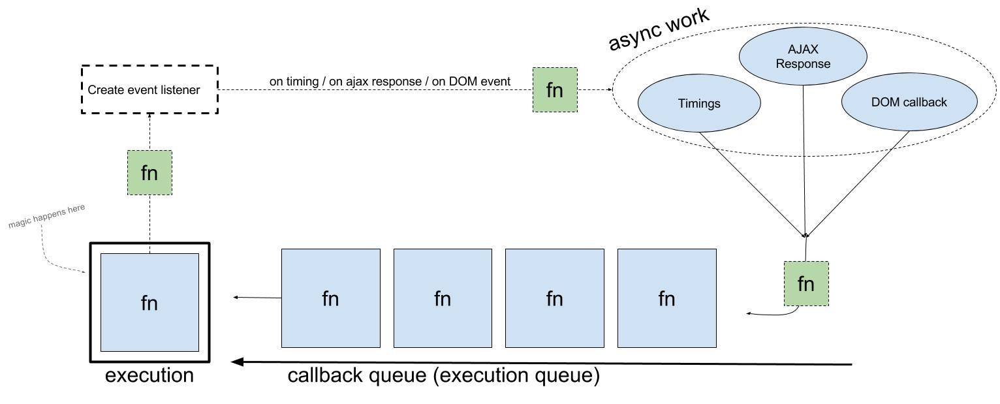

# Асинхронность в JS
JavaScript является однопоточным, но асинхронным языком программирования. 
Асинхронность в данном случае достигается за счет наличия очереди выполнения. 
Когда необходимо выполнить какую-либо асинхронную операцию, функция-колбэк, которая подписана на эту операция попадает в конец очереди. 
И будет выполненая когда интерпретор выполнит все функции перед ней. 
Так же эта функция может создать любую другую асинхронную операцию, которая в определённый момент времени попадет в конец очереди.



Важно понимать, что если заблокировать эту очередь тяжелой операцией то остальные функции не будут выполнены пока не завершится эта операция.
Это называется заблокировать thread. Чтобы этого избежать нужно разбивать тяжелые операции на маленькие асинхронные функции.
Самый просто способ выполнить функцию асинхронно это с помощью `setTimeout`

```js
setTimeout(function() { console.log(2) }, 0)
setTimeout(function() { console.log(3) }, 0)
console.log(1)
```
Результат будет: 1 2 3

## Callback hell
Самый простой способ отреагировать на выполнение асинхронной опрерации это передать в неё функцию-callback, 
но когда нужно сделать несколько последовательных асинхронных операций код становится малочитабельным.


## I Promise, мир не будет прежним
